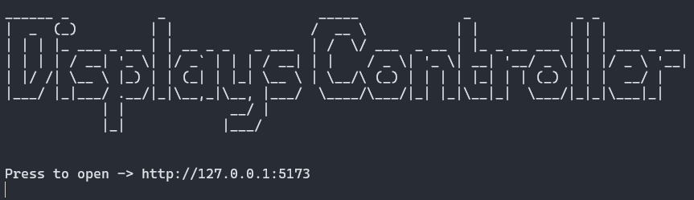

# Displays Controller

### A tool that makes it easy to **view** and **control** all displays connected to your computer

#### Supported Browsers 

[](#)
[](#)

#### Supported Systems

[](#)

## Usage

### Connect your displays


### Maximize and minimize previews


### Click to control _(p.s. Display is behind my back)_


## Installation

**Requirements**
- [Rust](https://rustup.rs/) — for backend
- [Node.js (LTS)](https://nodejs.org/) — for frontend

```bash
git clone https://github.com/arkadii888/DisplaysController.git
cd DisplaysController/front

# Allow npm scripts to run in PowerShell (Windows only)
Set-ExecutionPolicy -Scope CurrentUser RemoteSigned -Force

# Install frontend dependencies
npm install

# Run backend (starts both backend and frontend)
cd ../back
cargo run
```




### After setup is complete, you can use Displays Controller anytime by simply running:

```bash
cd DisplaysController/back
cargo run
```
